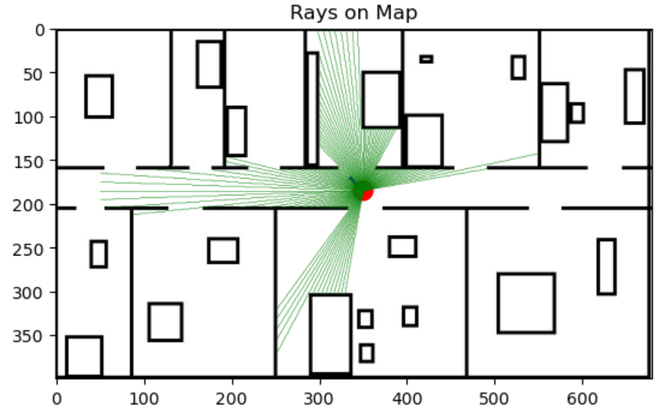
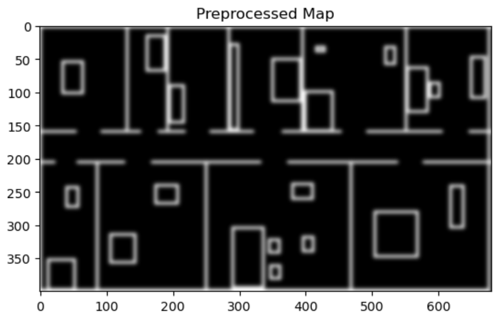
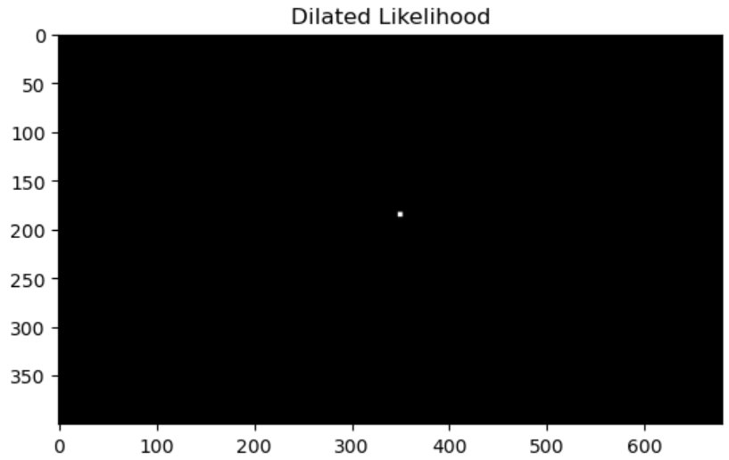
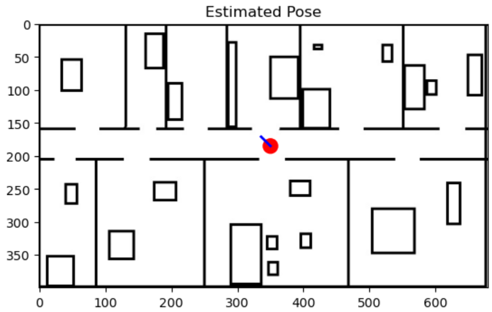

<h1 align='center'>Sensor Model Assignment</h1>

## 📝 Table of Contents

- [Requirement 1](#req1)
  - [Steps](#steps1)
  - [Example](#ex1)
- [Requirement 2](#req2)
  - [Steps](#steps2)
  - [Example](#ex2)

## 📃 Requirement 1 
### Steps 
 <h4>1-Load the Environment Map</h4>
 Use a provided image of a robot's environment where obstacles and free spaces are represented.

 <h4>2-Visualize the Map</h4>
 Display the map and overlay the given robot's position and orientation.

 <h4>3-Simulate Sensor Rays</h4>
 Cast rays of lenght 12m (max range) from the robot in various directions to simulate its sensors scanning the environment.

 <h4>4-Detect Obstacles</h4>
 For each ray, identify the point where it first intersects with an obstacle.

 <h4>5-Calculate Metrics</h4>
 Measure the distance to the obstacle and determine its coordinates relative to the robot.
 
 <h4>Display Results</h4>
 Visualize the detected rays on the map and output the collected data about each ray.

 ### Example 
 This output is generated for the robot's pose at (x = 14 m, y = 7.4 m, θ = 135°), corresponding to (x = 350 pixels, y = 185 pixels).
 

## 📃 Requirement 2 
### Steps 
 <h4>1-Preprocess the Map</h4>
 <ul>
 <li>Convert the map image to grayscale.</li>
 <li>Apply thresholding to distinguish obstacles (black areas) and free spaces (white areas).</li>
 <li>Apply Gaussian blur to smoothen the map and reduce noise.</li>
 <li>Add slight noise to the map to improve robustness during likelihood estimation.</li>
 </ul>
 <h4>2-Iterate Over Grid Cells</h4>
 <ul>
 <li>Loop through the map in intervals (e.g., every 5 pixels for faster computation).</li>
 <li>For each grid cell (x, y), evaluate all possible orientations . </li>
 </ul>
 <h4>3-Compute Likelihood for Each Orientation</h4>
 <ul>
 <li>Simulate rays from the cell at specified angles (range and step) to match the observations.</li>
 <li>For each simulated ray, trace the path and compute the likelihood based on whether the observed distance matches the map's obstacle positions.</li>
 <li>Adjust likelihood for rays that exceed map boundaries by penalizing them with small values.</li>
 </ul>
 <h4>4-Update Best Pose</h4>
 If the likelihood for the current grid cell and orientation is higher than the previous best, update the best pose.
 <h4>5-Create and Visualize Likelihood Map</h4>
 <ul>
 <li>Plot the likelihood map to visualize the likelihood values for different regions.</li>
 <li>Apply dilation to smooth the likelihood map and highlight potential poses.</li>
 </ul>
 <h4>6-Visualize Best Pose on Map Results</h4>
 Overlay the most likely pose (highest likelihood) onto the original map.

 ### Example 
 This output is generated given the distances from example 1 for the robot's pose at (x = 14 m, y = 7.4 m, θ = 135°), corresponding to (x = 350 pixels, y = 185 pixels).
 
 
 

